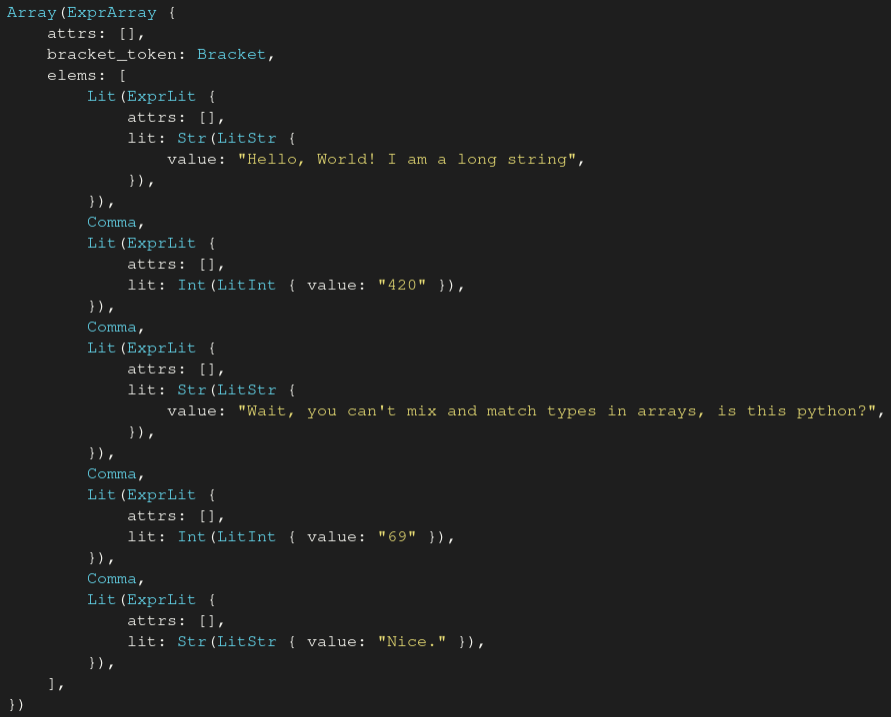
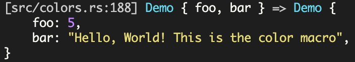

# dbg-pls

[](https://crates.io/crates/dbg-pls)
[](https://docs.rs/dbg-pls/latest/dbg_pls/)

A `Debug`-like trait for rust that outputs properly formatted code

## Showcase

Take the following code:

```rust
let code = r#"
    [
        "Hello, World! I am a long string",
        420,
        "Wait, you can't mix and match types in arrays, is this python?",
        69,
        "Nice."
    ]
"#;
let expr: syn::Expr = syn::parse_str(code).unwrap();
println!("{expr:?}");
```

This outputs
```
Array(ExprArray { attrs: [], bracket_token: Bracket, elems: [Lit(ExprLit { attrs: [], lit: Str(LitStr { token: "Hello, World! I am a long string" }) }), Comma, Lit(ExprLit { attrs: [], lit: Int(LitInt { token: 420 }) }), Comma, Lit(ExprLit { attrs: [], lit: Str(LitStr { token: "Wait, you can't mix and match types in arrays, is this python?" }) }), Comma, Lit(ExprLit { attrs: [], lit: Int(LitInt { token: 69 }) }), Comma, Lit(ExprLit { attrs: [], lit: Str(LitStr { token: "Nice." }) })] })
```
which is far too dense to read.

If we change the println to use the alternate printing (`:#?`), then we get
```rust
Array(
    ExprArray {
        attrs: [],
        bracket_token: Bracket,
        elems: [
            Lit(
                ExprLit {
                    attrs: [],
                    lit: Str(
                        LitStr {
                            token: "Hello, World! I am a long string",
                        },
                    ),
                },
            ),
            Comma,
            Lit(
                ExprLit {
                    attrs: [],
                    lit: Int(
                        LitInt {
                            token: 420,
                        },
                    ),
                },
            ),
            Comma,
            Lit(
                ExprLit {
                    attrs: [],
                    lit: Str(
                        LitStr {
                            token: "Wait, you can't mix and match types in arrays, is this python?",
                        },
                    ),
                },
            ),
            Comma,
            Lit(
                ExprLit {
                    attrs: [],
                    lit: Int(
                        LitInt {
                            token: 69,
                        },
                    ),
                },
            ),
            Comma,
            Lit(
                ExprLit {
                    attrs: [],
                    lit: Str(
                        LitStr {
                            token: "Nice.",
                        },
                    ),
                },
            ),
        ],
    },
)
```
which is far too spread out to be natural.

This is where `dbg_pls` comes in. Replace the println with
```rust
println!("{}", dbg_pls::color(&expr));
```
And you get



## Usage in libraries

```sh
cargo add dbg-pls
```

Add to your types

```rust
#[derive(dbg_pls::DebugPls)]
```

## Usage for applications

```sh
cargo add dbg-pls +pretty
```

And print using `pretty`, eg

```rust
println!("{}", dbg_pls::pretty(&value));
```

## Features

* `derive` - enables the `#[derive(DebugPls)]` derive
* `pretty` - enables the `pretty` function for pretty printing
* `colors` - enables the `color` function for syntax highlighted printing

## Example

```rust
use dbg_pls::{pretty, DebugPls};

#[derive(DebugPls, Copy, Clone)]
pub struct Demo {
    foo: i32,
    bar: &'static str,
}

let mut val = [Demo { foo: 5, bar: "hello" }; 10];
val[6].bar = "Hello, world! I am a very long string";

println!("{}", pretty(&val));
```
Outputs
```text
[
    Demo { foo: 5, bar: "hello" },
    Demo { foo: 5, bar: "hello" },
    Demo { foo: 5, bar: "hello" },
    Demo { foo: 5, bar: "hello" },
    Demo { foo: 5, bar: "hello" },
    Demo { foo: 5, bar: "hello" },
    Demo {
        foo: 5,
        bar: "Hello, world! I am a very long string",
    },
    Demo { foo: 5, bar: "hello" },
    Demo { foo: 5, bar: "hello" },
    Demo { foo: 5, bar: "hello" },
]
```

## Example (highlighting)

```rust
use dbg_pls::{color, DebugPls};

#[derive(DebugPls, Copy, Clone)]
pub struct Demo {
    foo: i32,
    bar: &'static str,
}

let mut val = [Demo { foo: 5, bar: "hello" }; 10];
val[6].bar = "Hello, world! I am a very long string";

println!("{}", color(&val));
```
Outputs:


## Example (dbg-style macros)

```rust
use dbg_pls::{color, DebugPls};

#[derive(DebugPls, Copy, Clone)]
pub struct Demo {
    foo: i32,
    bar: &'static str,
}

let foo = 5;
let bar = "Hello, World! This is the color macro";
let _ = color!(Demo { foo, bar });
```
Outputs:




```rust
use dbg_pls::{pretty, DebugPls};

#[derive(DebugPls, Copy, Clone)]
pub struct Demo {
    foo: i32,
    bar: &'static str,
}

let foo = 5;
let bar = "hello";
let _ = pretty!(Demo { foo, bar });
```
Outputs:

```text
[src/lib.rs:558] Demo { foo, bar } => Demo { foo: 5, bar: "hello" }
```
